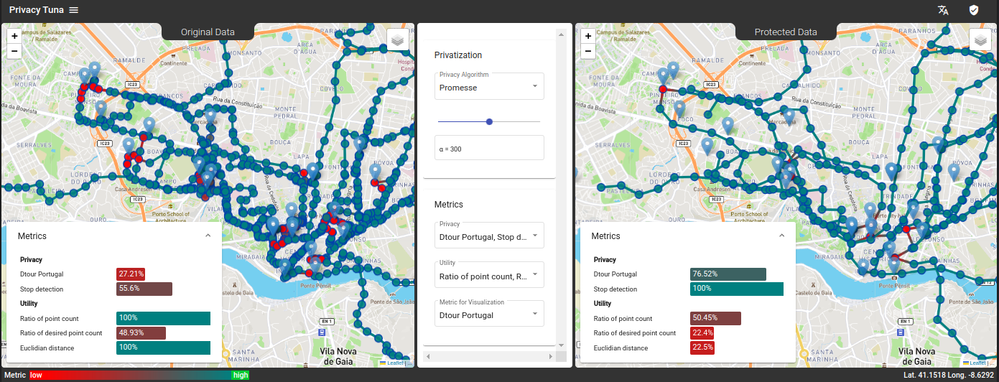

# Privacy Tuna: Tuning the Utility-Privacy Trade-Off in Trajectory Data

*Privacy Tuna* is an open source visualization system that enables users to assess the privacy risk in 
trajectory data, to apply privacy-preserving mechanisms and intuitively tune the trade-off 
between utility and privacy by adjusting the parameters of the algorithm.

### The Privacy of Trajectory Data
Trajectory data, often collected on a large scale with mobile sensors in smartphones and vehicles, 
is a valuable source for realizing smart city applications, or improving the user experience in apps. 
But such data can also leak private information about those who produced it. It can reveal not only a person's 
whereabouts, but also very personal information about them, such as their points of interest (POI), which in turn can 
reveal a person's age, gender, religion or home and work address. Location privacy preserving mechanisms (LPPM) can 
mitigate this issue by transforming the data so that private details are protected. But privacy-preservation 
typically comes at the cost of a loss of utility. It can be challenging to find a suitable mechanism and the right 
settings to satisfy privacy as well as utility. 
an interactive framework to visualize trajectory data, and intuitively estimate data utility and privacy while applying LPPMs.
Our tool makes it easy for data owners to investigate the value of their data, choose the right mechanism and tune its
parameters to achieve a good utility-privacy trade-off.

### Features of *Privacy Tuna*

- Visualize trajectory data and visually compare raw and protected data
- Understand and estimate the risks from potential privacy leakage in the data
- Find a suitable privacy-preserving mechanism that prevents information leakage
- Measure the utility of the data to understand its value
- Tune the parameters of privacy-preserving mechanisms to achieve a good balance between utility and privacy

More information can be found [here](resources/Frontend_Demo_v5_repo.pdf).

### Demonstrator & Video

You can try out our demonstrator [here](https://livinglab.scadsai.uni-leipzig.de/privacy-tuna/).
It includes a few routes from Porto Taxi dataset [[1](resources/D_TOUR_Schneider.pdf)], 
consisting of cab rides in Porto, Portugal. The dataset can be found [here](resources/porto_taxi_dataset.csv).
To get a quick overview over the features and how to use *Privacy Tuna*, take a look at the 
<a href="https://cloud.scadsai.uni-leipzig.de/index.php/s/pdjMfiEMbQcXYZD" target="_blank">demonstration video</a>.

### License
*Privacy Tuna* is licensed under [Apache License, Version 2.0](LICENSE)

### Acknowledgement
*Privacy Tuna* is developed by University of Leipzig & ScaDS.AI Dresden/Leipzig, Germany under the financial support by the Federal 
Ministry of Education and Research of Germany and by the S&auml;chsische Staatsministerium f&uuml;r Wissenschaft Kultur und 
Tourismus in the program Center of Excellence for AI-research "Center for Scalable Data Analytics and Artificial 
Intelligence Dresden/Leipzig", project identification number: ScaDS.AI

### References
[[1]](resources/D_TOUR_Schneider.pdf) Schneider et al. (2022), D-TOUR : Detour-based point of interest detection in privacy-sensitive trajectories